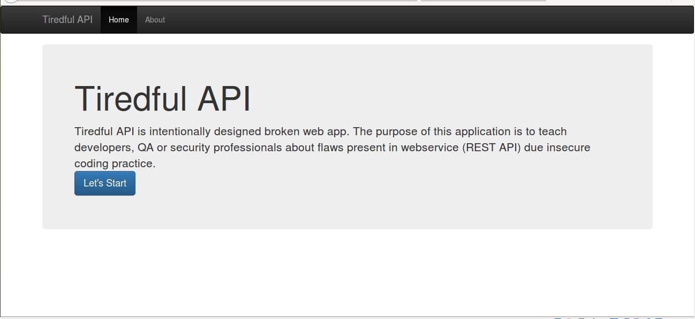

### What is Tiredful API?

Tiredful API is intentionally designed broken app. The aim of this web app is to teach developers, QA  or security professionals about flaws present in webservice (REST API) due insecure coding practice.

### Who can use Tiredful API?
* Web developers
* Web Pentesters
* Security Professionals
* Student

### What is included in Tiredful API?

I tried to cover most of the vulnerabilities, I am sure that we have missed some vulnerabilities.Please ping me if you know any good vulnerability that should be included. For now I have included following vulnerabilities.

* Information Disclosure
* Insecure Direct Object Reference
* Access Control
* Throttling
* SQL Injection (SQLite)
* Cross Site Scripting.

### Can I contribute?
Yes, you can help by sending us the details of vulnerabilities that we can implement in future versions of Tiredful API. Please mail us at info[at]payatu.com with subject "Tiredful API Scenario".

### Where can I get Tiredful API?
Source can be downloaded from .

### How to run Tiredful API?
Tiredful API is developed using Django Framework and Django Rest Framework, so for running the web server user needs execute following command.

* Navigate to the source folder and locate manage.py file.
* Then execute `python manage.py runserver`.
* If static files are not getting load, then execute above command with insecure flag i.e. `python manage.py runserver --insecure`
If you are facing any issue starting the web server please refer  or .
Please ping me if you are still not able to run development server.

**Note:** It is recommended to use required libraries with the version specified in the requirements.txt. Please refer  more details

### Feedback and Bug Reports.
We would love to hear from you about your experience with Tiredful API. Please send us an email on info [at] payatu [dot] com or siddharth [dot] bezalwar [at] gmail [dot] com with Subject "Tiredful API Issue" based on what you want to share. Please include the below in your email.

* Operating system with version.
* Django Framework used.
* Steps to replicate issue.

### Author
Siddharth Bezalwar

@fattu_medjai | siddharth [dot] bezalwar [at] gmail [dot] com

### About Payatu
Payatu is a boutique security testing company with specialization in:

* IoT Security
* Mobile Security
* Cloud security
* Web Security
We also organize two International Security Conferences

nullcon International Security Conference - http://nullcon.net
hardwear.io Hardware Security Conference - http://hardwear.io
**Website:** http://payatu.com **Email:** info (at) payatu dot com
